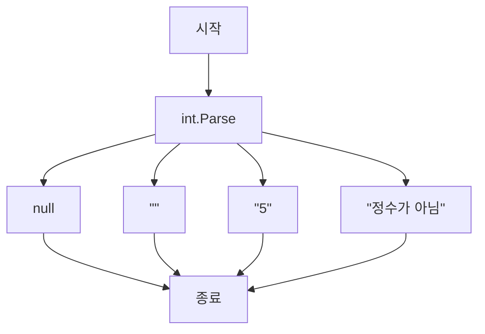

커버리지 지표는 테스트 스위트(test suite)가 소스 코드를 얼마나 실행하는지를 백분율로 나타낸다.

> [!NOTE] 테스트 스위트(test suite)
> 테스트 케이스(여기서 이것은 하나의 메소드를 테스트하기 위한 테스트 메소드를 의미)들을 하나로 묶은 것.
> 테스트 스위트는 자신의 테스트 케이스들을 실행한다.

커버리지 지표는 중요한 피드백을 주더라도 테스트 스위트 품질을 효과적으로 측정하는 데 사용될 수 없다. 코드를 단위 테스트 하는 것과 같은 상황이다.
즉, 커버리지 지표는 괜찮은 부정 지표이지만 좋지 않은 긍정 지표다.
코드 커버리지가 너무 적을 때는(ex: 10%) 테스트가 충분치 않다는 증거다. 그러나 반대의 경우는 그렇지 못하다.
100% 커버리지라고 해서 반드시 양질의 테스트 스위트라고 보장하지는 않는다. 높은 커버리지의 테스트 스위트도 품질이 떨어질 수 있다.

## 코드 커버리지 지표 예시

$$
코드 커버리지(테스트 커버리지) = {제품\space코드\space라인\space수\over 전체\space라인\space수}
$$

다음 예시를 보자.
`IsStringLong` 메서드와 이를 다루는 테스트가 있다. 메서드는 입력 매개변수로 제공된 문자열이 긴지 여부를 판별한다.
```c#
public static bool IsStringLong(string input)
{
	if (input.Length > 5)
		return true;
    return false;
}
```

```c#
public void Test()
{
	bool result = IsStrongLong("abc");
	Assert.Equal(false, result);
}
```
여기서 코드 커버리지를 쉽게 계산할 수 있다. 메서드 전체 라인 수는 5(중괄호 포함)이다. 테스트가 실행하는 라인 수는 4이다. 테스트느 `true`를 반환하는 구문을 제외한 모든 코드라인을 통과한다. 따라서 코드 커버리지는 4/5 = 0.8 = 80% 이다.

이제 메서드를 리팩터링하고 부필요한 if 문을 한 줄로 처리하면 어떻게 될까?

```c#
public static bool IsStringLong(string input)
{
	return input.Length > 5;
}
```

테스트는 이제 코드 세 줄을 모두 점검하기 때문에 코드 커버리지가 100%로 증가했다. 하지만 리팩터링으로 테스트 스위트를 개선했는가? 물론 그렇지 않다. 단지 메서드 내 코드를 바꿨을 뿐이다. 이 테스트가 검증하는 결과 개수는 여전히 같다.

이 간단한 예제는 커버리지 숫자에 대해 얼마나 쉽게 장난칠 수 있는지 보여준다. 코드가 작을수록 커버리지 지표는 더 좋아지는데, 이는 원래 라인 수만 처리하기 때문이다. 그리고 코드를 더 작게 해도 테스트 스위트의 가치나 기반 코드베이스의 유지 보수성이 변경되지 않는다. (변경해서도 안 된다.)

## 분기 커버리지 지표 예시

분기 커버리지는 코드 커버리지의 단점을 극복하는 데 도움이 되므로 코드 커버리지보다 더 정확한 결과를 제공한다.
분기 커버리지 지표는 원시 코드 라인 수를 사용하는 대신 if 문과 switch 문과 같은 제어 구조에 중점을 둔다.
$$
분기 커버리지 = {통과\space분기 \over 전체\space분기\space수}
$$
분기 커버리지 지표를 계산하려면 코드베이스에서 모든 가능한 분기를 합산하고 그 중 테스트가 얼마나 많이 실행되는지 확인해야 한다. 이전의 예를 다시 보자.
```c#
public static bool IsStringLong(string input)
{
	return input.Length > 5;
}
```

```c#
public void Test()
{
	bool result = IsStrongLong("abc");
	Assert.Equal(false, result);
}
```

`IsStringLong` 메서드에 두 개의 분기가 있는데, 하나는 문자열 인수의 길이가 다섯 자를 초과하는 상황에 대한 것이고 다른 하나는 그렇지 않은 경우다.
테스트는 이런 분기중 하나에 대해서만 적용되므로 분기 커버리지 지표는 1/2 = 0.5 = 50%이다.
이전과 같이 if문을 사용하든 더 짧은 표기법을 사용하든, 테스트 코드는 어떻게 작성해도 상관없다. 분기 커버리지 지표는 분기 개수만 다루며, 해당 분기를 구현하는 데 얼마나 코드가 필요한지 고려하지 않는다.

## 커버리지 지표에 관한 문제점

분기 커버리지로 코드 커버리지보다 더 나은 결과를 얻을 수 있지만, 테스트 스위트의 품질을 결정하는 데 어떤 커버리지 지표도 의존할 수 없는 이유는 다음과 같다.
- 테스트 대상 시스템의 모든 가능한 결과를 검증한다고 보장할 수 없다.
- 외부 라이브러리의 코드 경로를 고려할 수 있는 커버리지 지표는 없다.

### 가능한 모든 결과를 검증한다고 보증할 수 없음
단지 코드 경로를 통과하는 것이 아니라 실제로 테스트하려면, 단위 테스트에는 반드시 적절한 검증이 있어야 한다. 다시 말해, 테스트 대상 시스템이 낸 결과가 정확히 예상하는 결과인지 확인해야 한다. 더구나 결과가 여러 개 있을 수 있다. 따라서 커버리지 지표가 의미가 있으려면, 모든 측정 지표를 검증해야 한다.

다음 예지는 `IsStringLong` 메서드의 다른 버전을 보여준다. `WasLastStringLong` 공개 속성에 마지막 결과를 기록한다.
```c#
public static bool WasLastStringLong { get; private set; }

public static bool IsStringLong(string input)
{
	bool result = input.Length > 5;
	WasLastStringLong = result;
	return result;
}

public void Test()
{
	bool result = IsStringLong("abc");
	Assert.Equal(false, result);
}
```
`IsStringLong` 메서드에는 이제 값을 반환하는 명시적인 결과와 속성에 새로운 값을 쓰는 암묵적인 결과가 있다. 그리고 두 번째 암묵적인 결과를 검증하지 않더라도 커버리지 지표는 100% 코드 커버리지와 50% 분기 커버리지의 동일한 결과를 보여준다.
보다시피 **커버리지 지표는 기반 코드를 테스트했다고 보장할 수 없으며 일부 실행된 것만 보장한다**.

이렇게 결과를 부분적으로 테스트 한 것보다 더 극단적인 상황은 검증이 전혀 없는 테스트의 경우다. 다음은 검증이 없는 테스트를 보여주는 예제다.
```c#
public void Test()
{
	bool result1 = IsStringLong("abc");
	bool result2 = IsStringLong("abcdef");
}
```
이 테스트에서는 코드 커버리지와 분기 커버리지가 둘 다 100%를 나타내고 있다. 그러나 아무것도 검증하지 않기 때문에 전혀 쓸모가 없다.

### 외부 라이브러리의 코드 경로를 고려할 수 없음
두 번째 문제는 모든 커버리지 지표가 테스트 대상 시스템이 메서드를 호출할 때 외부 라이브러리가 통과하는 코드 경로를 고려하지 않는다는 것이다. 다음 예를 들어보자.
```c#
public static int Parse(string input)
{
	return int.Parse(input);
}

public void Test()
{
	int result = Parse("5");
	Assert.Equal(5, result);
}
```
분기 커버리지 지표는 100%로 표시되며 테스트는 메서드 결과의 모든 구성 요소를 검증한다.
단지 값을 반환하는 한 줄이라 하더라도 단일한 구성 요소이기는 하다. 하지만 이 테스트는 완벽하지 않다.
.NET 프레임워크의 `int.Parse` 메서드가 수행하는 코드 경로는 고려하지 않는다. 다음 그림과 같이 간단한 메서드에도 꽤 많은 코드 경로가 존재한다.



빌트인 정수 타입에는 메서드의 입력 매개변수를 변경하면 다른 결과로 이어질 수 있고 테스트로부터 숨어있는 분기가 많다. 다음은 정수로 변환할 수 없는 몇 가지 가능한 인수다.
- null 값
- 빈 문자열
- "정수가 아님"
- 너무 긴 문자열

수많은 예외 상황(edge case)에 빠질 수 있지만, 테스트에서 모든 예외 상황을 다루는지 확인할 방법이 없다.
이는 커버리지 지표가 외부 라이브러리의 코드 경로를 고려해야 한다는 것이 아니라, 해당 지표는 단위 테스트가 얼마나 좋은지 나쁜지를 판단할 수 없다는 것을 보여준다.
커버리지 지표로 테스트가 철저한지 또는 테스트가 충분하지 알 수는 없다.

## 커버리지 숫자를 목표로 하기

테스트 스위트 품질을 결정하기에 커버리지 지표만으로는 충분치 않다는 것을 알았다.
100%, 90% 심지어 중간 정도인 70%까지 특정 커버리지 숫자를 목표로 삼기 시작하면 위험 영역으로 이어질 수 있다. 커버리지 지표를 보는 가장 좋은 방법은 **지표 그 자체로 보는 것이며, 목표로 여겨서는 안 된다**.

병원에 있는 환자를 생각해보자. 체온이 높으면 열이 난다는 것을 의미할 수 있으며, 이는 유용한 관찰이다. 그러나 병원은 환자의 적절한 체온을 목표로 해서는 안 된다. 단순히 목표가 되면, 환자 옆에 에어컨을 설치해서 '효율적으로' 빨리 끝낼 수도 있다. 물론 이런 접근은 의미가 없다.

마찬가지로 특정 커버리지 숫자를 목표로 하는 것은 단위 테스트의 목표와 반대되는 그릇된 동기 부여가 된다. 사람들은 중요한 것을 테스트하는 데 집중하는 대신 인공적인 목표를 달성하기 위한 방법을 찾기 시작한다. 적절한 단위 테스트는 이미 충분히 어렵다. 커버리지 숫자를 강요하면 개발자들은 테스트 대상에 신경쓰지 못하고, 결국 적절한 단위 테스트는 더욱 달성하기 어려워진다.

다시 말하면, 커버리지 지표는 좋은 부정 지표이지만 나쁜 긍정 지표다. 커버리지 숫자가 낮으면 (ex: 60% 미만) 문제 징후라 할 수 있다. 코드 베이스에 테스트되지 않은 코드가 많다는 뜻이다. 그러나 높은 숫자도 별 의미는 없다. 그러므로 코드 커버리지를 측정한다는 것은 품질 테스트 스위트로 가는 첫걸음일 뿐이다.

## 무엇이 성공적인 테스트 스위트를 만드는가?

제대로 하려면 어떻게 해야 할까? 테스트 스위트의 품질을 어떻게 측정해야 하는가? 믿을 만한 방법은 스위트 내 각 테스트를 하나씩 따로 평가하는 것뿐이다. 물론 한 번에 모든 것을 평가할 필요는 없다. 꽤 큰 작업이 될 수 있고, 이에 앞서 노력을 상당히 들여야 할 수도 있다. 평가를 하나씩 늘려가며 수행할 수도 있다. 요점은 **테스트 스위트가 얼마나 좋은지 자동으로 확인할 수 없다는 것이다. 개인 판단에 맡겨야 한다**.

성공적인 테스트 스위트는 다음과 같은 특성을 갖고 있다.
- 개발 주기에 통합돼 있다.
- 코드베이스에서 가장 중요한 부분만을 대상으로 한다.
- 최소한의 유지비로 최대의 가치를 끌어낸다.

### 개발 주기에 통합돼 있음
자동화된 테스트를 할 수 있는 방법은 끊임없이 하는 것뿐이다. 모든 테스트는 개발 주기에 통합돼야 한다. 이상적으로는 코드가 변경될 때마다 아무리 작은 것이라도 실행해야 한다.

### 코드베이스에서 가장 중요한 부분만을 대상으로 함
모든 테스트가 똑같이 작성되지 않은 것처럼 단위 테스트 측면에서 코드베이스의 모든 부분에 똑같이 주목할 필요는 없다. 테스트가 주는 가치는 테스트 구조뿐만 아니라 검증하는 코드에도 있다.

시스템의 가장 중요한 부분에 단위 테스트 노력을 기울이고, 다른 부분은 간략하게 또는 간접적으로 검증하는 것이 좋다. 대부분의 애플리케이션에서 가장 중요한 부분은 비즈니스 로직이 있는 부분이다. 비즈니스 로직 테스트가 시간 투자 대비 최고의 수익을 낼 수 있다.

다른 모든 부분은 세 가지 범주로 나눌 수 있다.
- 인프라 코드
- 데이터베이스나 서드파티 시스템과 같은 외부 서비스 및 종속성
- 모든 것을 하나로 묶는 코드
그러나 이 중 일부는 단위 테스트를 철저히 해야 할 수 있다. 예를 들어 인프라 코드에 복잡하고 중요한 알고리즘이 있을 수 있으므로, 테스트를 많이 하는 것이 좋다. 그러나 일반적으로 도메인 모델에 관심을 더 많이 갖는 것이 옳다.

통합 테스트와 같이 일부 테스트는 도메인 모델을 넘어 코드베이스의 중요하지 않은 부분을 포함해 시스템이 전체적으로 어떻게 동작하는지 확인할 수 있다. 이것도 괜찮다. 그러나 **초점은 도메인 모델에 머물러 있어야 한다**.
이 지침을 따르려면 도메인 모델을 코드베이스 중 중요하지 않은 부분과 분리해야 한다. 도메인 모델을 다른 애플리케이션 문제와 분리해야 단위 테스트에 대한 노력을 도메인 모델이만 집중할 수 있다.

### 최소 유지비로 최대 가치를 끌어냄
단위 테스트에서 가장 어려운 부분은 최소 유지비로 최대 가치를 달성하는 것이다.
테스트를 빌드 시스템에 통합하는 것만으로는 충분하지 않으며, 도메인 모델에 높은 테스트 커버리지를 유지하는 것도 충분하지 않다. 또한 **가치가 유지비를 상회하는 테스트만 스위트에 유지하는 것이 중요**하다.

이 마지막 속성은 두 가지로 나눌 수 있다.
- 가치 있는 테스트(더 나아가, 가치가 낮은 테스트) 식별하기
- 가치 있는 테스트 작성하기
이러한 기술은 비슷해 보일지 모르지만, 선천적으로 다르다.
가치가 높은 테스트를 식별하려면 기준틀이 필요하다. 반면에 가치 있는 테스트를 작성하려면 코드 설계 기술도 알아야 한다. 단위 테스트와 기반 코드는 서로 얽혀 있으므로 코드베이스에 노력을 많이 기울이지 않으면 가치 있는 테스트를 만들 수 없다.

좋은 곡을 식별하는 것과 작곡할 수 있는 것의 차이로 볼 수 있다. 작곡가가 되는 필요한 노력의 양은 좋은 음악과 나쁜 음악을 구별하는 데 필요한 노력보다 비대칭적으로 크다. 단위 테스트도 마찬가지다. 새로운 테스트를 작성하는 것은 기존 테스트를 시험하는 것보다 더 많은 노력이 드는데, 대부분 아무것도 없는 상태에서 테스트를 작성하지 않고 기반 코드를 고려해야 하기 때문이다.